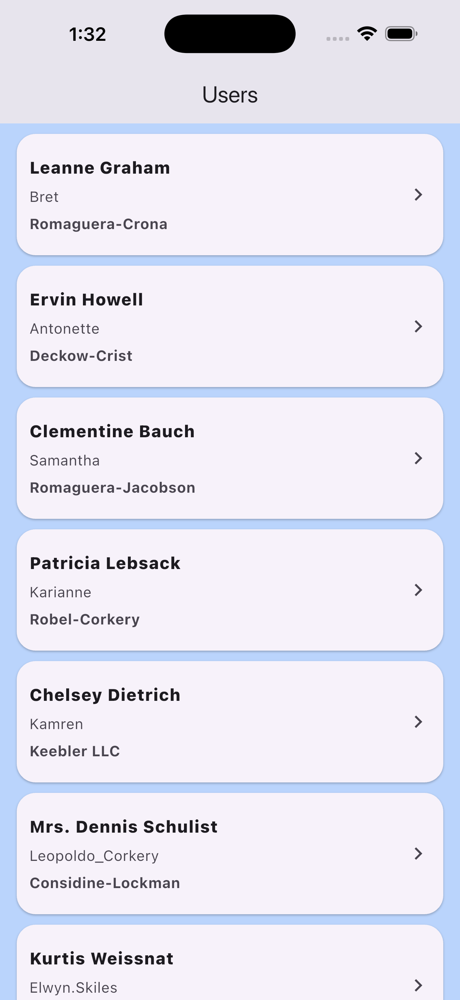
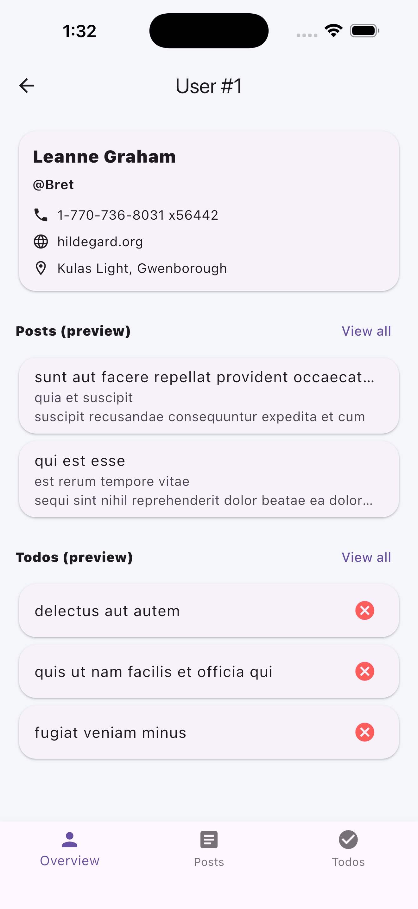
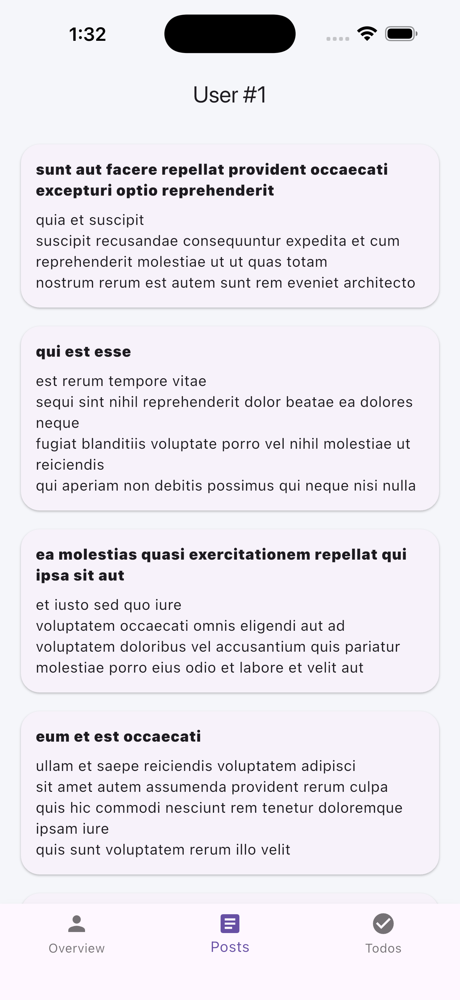
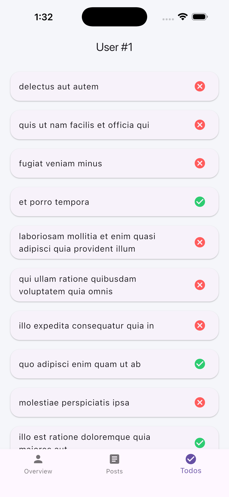

# User Hub App

A Flutter application that integrates user profiles, posts, and tasks using a REST API.

The app fetches data from the JSONPlaceholder API and displays it in a simple and organized interface.

---

## Features

- View a list of all users
- Navigate to a specific user's profile
- Display user contact information
- View posts created by the user
- View user todos with completion status

---

## Screens

### Users Screen
Displays all users with their basic information.

---

### User Overview
Shows user details including phone, website, and address.

---

### Posts Screen
Displays all posts created by the selected user.

---

### Todos Screen
Displays the user's tasks with completion indicators.

---

## Tech Stack

- Flutter
- Dio (HTTP Requests)
- GoRouter (Navigation)
- REST API (JSONPlaceholder)

---

## Author
Amaal Alanazi

